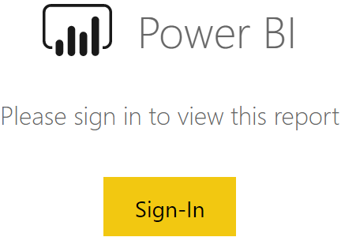
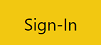

<a href="assets/DnD/Alterion/Alterion.map" >Alterion Map</a>

 
<h3>My Power BI reports aren't showing</h3>

 
 
If your dashboard tile looks like this...

 
...but nothing happens when you click the "Sign-In" button, <strong>right-click</strong> this button instead  and select "Open link in new tab/window". (Alternatively, CTRL+click on windows or CMD+click on a Mac should accomplish the same thing.)
  
Once you are logged in on the new tab/window, the report should automatically sign-in and update here on your dashboard. To force this to occur immediately, simply refresh the tile by clicking the "..." in the top-right corner and selecting "Refresh" from the drop-down menu.
 
<em>Note: Once signed-in, you don't need to keep the other browser tab/window open in order to stay signed-in on the dashboard.</em>

 
<h3>I have other questions about Prophix</h3>

 
You can open the <a href="https://help.prophix.cloud/">Prophix help page here</a> or <a href="mailto:msmith@gpsfx.com">email Mathew Smith</a> for GPS-specific Prophix questions.

